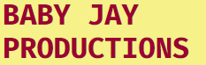
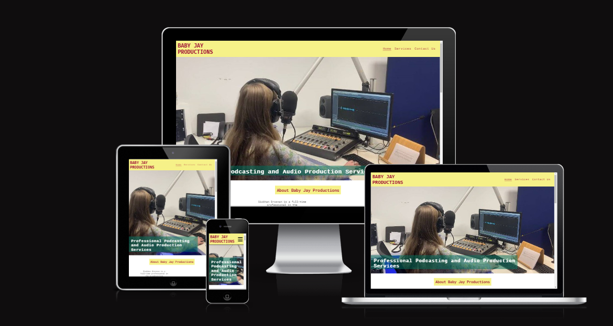
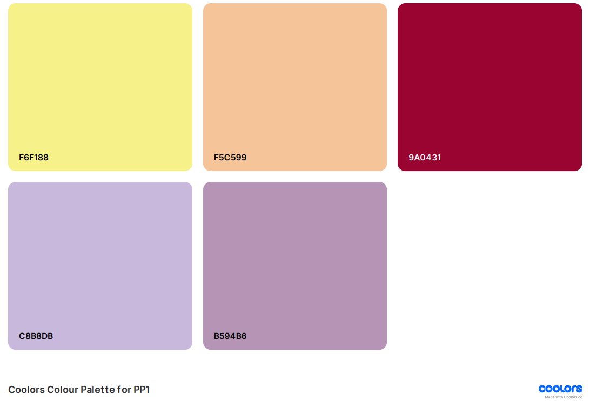
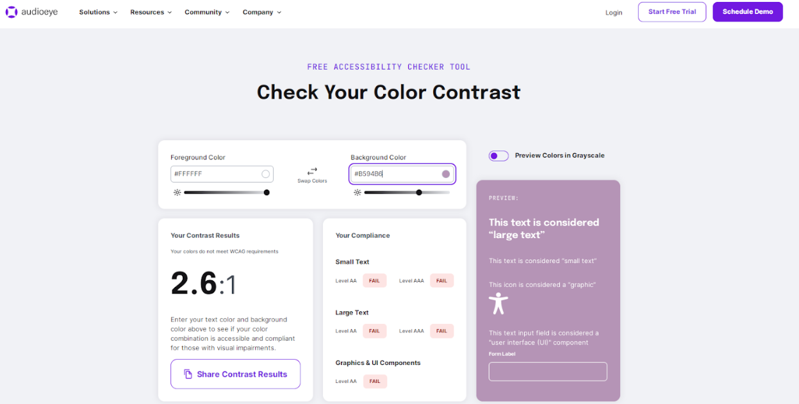
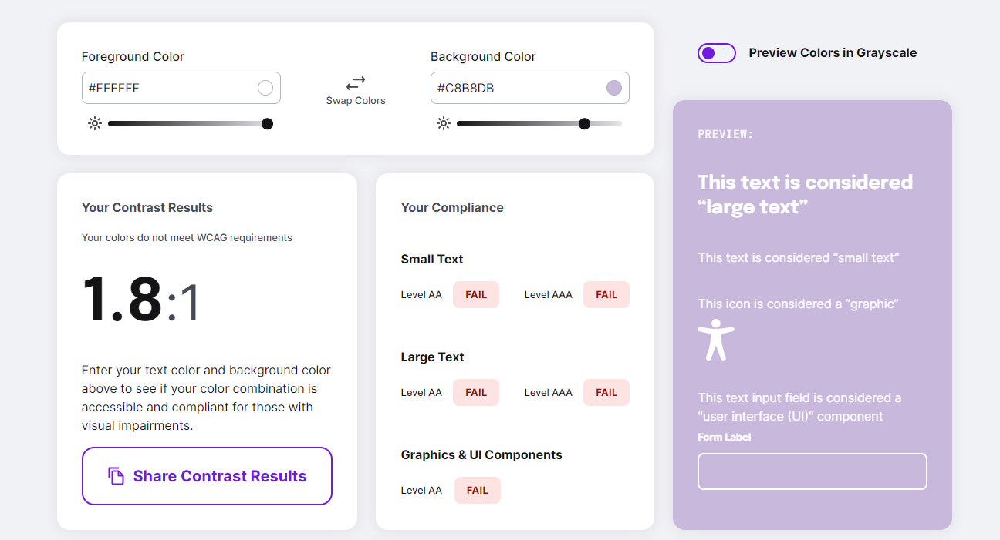
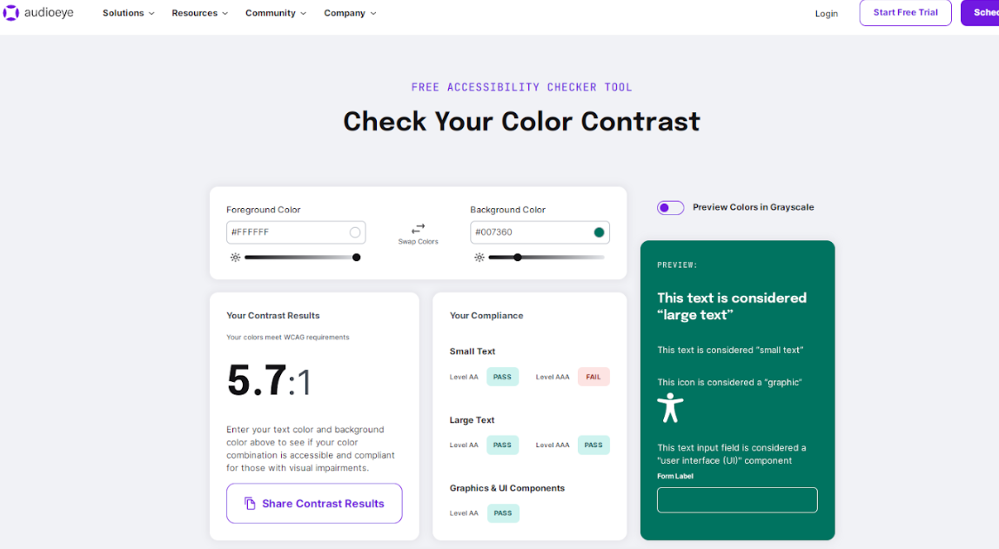
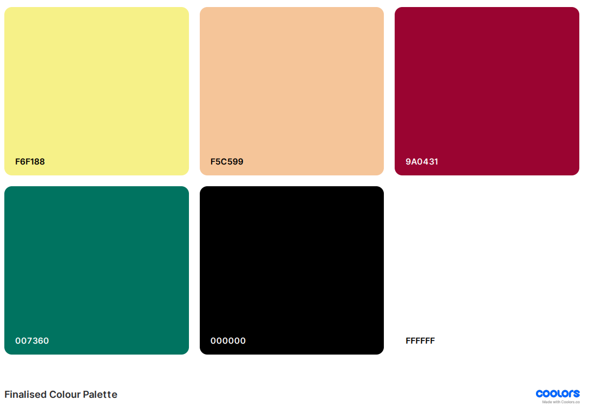
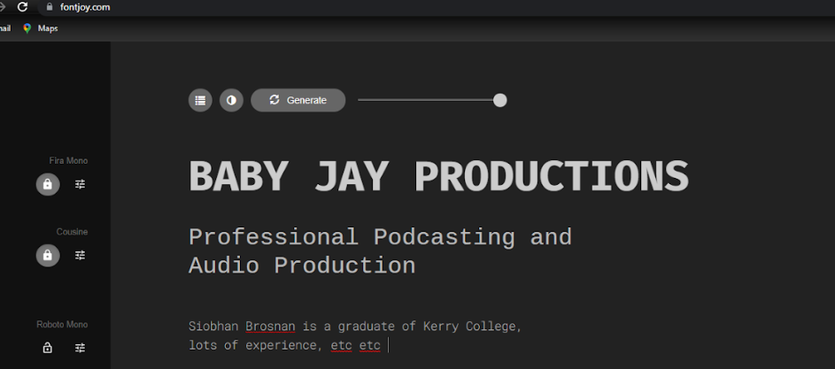

## Introduction

Baby Jay Productions is a website designed to promote the services of a professional audio production company of the same name run by Siobhan Brosnan, a professional in the radio broadcasting and podcasting industry based in Co. Kerry, Ireland. The objective of the website is to clearly communicate the breadth and depth of Siobhan's technical and creative services to brands, companies and individuals looking to set up their own podcasts.  From reading the website, users of the website will understand and appreciate the value that Siobhan could bring to their business or creative venture, thereby providing Siobhan with new clients. The website presents information in a vibrant and professional manner that is reflective of Siobhan's approach to her work. 

## UX

The primary goal was to create a vibrant, professional website that would provide prospective clients with a thorough and concise of Siobhan's skills as a technical and creative consultant in the audio and podcasting industry.

### Colour Scheme

From the outset, I understood that I wanted some bright colours to reflect Siobhan's creativity - however, it was important that the colours would appear suitably muted so as to simultaneously get her professional across to the site user, who would be likely to be a prospective client. As such, using the coolors.co website, I initially selected a palette of five colours to be used alongside black (#000000) and white (#FFFFFF).

However, after using the Colour Contrast Checker tool on audioeye.com, it was clear to me that the use of lilac (#B594B6) and thistle (#C8B8DB) would be unsuitable, as white (#FFFFFF) text upon these background colours would as background colours as white font would not meet the minimum score of 4.5 as per the Web Content Accessibility Guidelines (WCAG) 2.1.

As such, I removed these two colours from my palette and added a dark pine green that would contrast positively with the rest of the palette. This was confirmed to be acceptable in terms of the WCAG 2.1 as shown below:

With this change, my colour palette was finalised.  

### Typography

I used the fontjoy.com website to find three free Google Fonts that I found to be complementary. 

The three fonts selected - Fira Mono, Cousine, and Roboto Mono - are all sans-serif and so are well-suited in terms of their accessibility for screen reading. [Fira Mono](https://fonts.google.com/specimen/Fira+Mono) was used for the logo font; [Cousine](https://fonts.google.com/specimen/Cousine) was used for all sub-headings, while [Roboto Mono](https://fonts.google.com/specimen/Roboto+Mono) was used for paragraphs. Both Cousine and Roboto Mono share a similar, typewriter-style aesthetic that contrasts positively with the thick bold lines of Fira Mono.  

[Font Awesome](https://fontawesome.com) icons were also used throughout the site, such as the social media icons in the footer and above the sub-headings on the Services page.

## User Stories

### New Site Users

- As a new site user, I would like to know the purpose of the website, so that I can discern whether or not it is relevant to me.
- As a new site user, I would like to the website to be easily navigable, so that I can easily find the information that I may need.
- As a new site user, I would like to easily return to the home page by clicking the logo in the header, so that I can easily orient myself within the website. 
- As a new site user, I would like the website to have good SEO scores and semantic elements so that I can easily find it through a search engine.
- As a new site user, I would like to be assured that the interactive elements of the website work, so that I can have a positive experience that wouldn't result in frustration. 

### Returning Site Users

- As a returning site user, I would like to know where I can find further information on the business, such as their social media presence. 
- As a returning site user, I would like to know how to contact the business directly for commercial queries.

### Frequent Site Users

- As a new site user, I would like the website to be responsive to different screen widths, so that I can easily view it on a variety of devices.

## Wireframes

🛑🛑🛑🛑🛑🛑🛑🛑🛑🛑 START OF NOTES (to be deleted)

In this section, display your wireframe screenshots using a Markdown `table`.
Instructions on how to do Markdown `tables` start on line #213 on this site: https://pandao.github.io/editor.md/en.html

Alternatively, dropdowns are a way to condense several wireframes into a collapsible menu to save space.
Dropdowns in Markdown are considered some of the only acceptable HTML components that are allowed for assessment purposes.

⚠️ **IMPORTANT**! ⚠️ **IMPORTANT**! ⚠️ **IMPORTANT**! ⚠️
The example below uses the `details` and `summary` code elements.
However, for these scripts to work, I've had to add spaces within the `< >` elements.

You MUST remove these spaces for it to work properly on your own README/TESTING files.
Remove the spaces within the `< >` brackets for the `details` and `summary` code elements,
for the Mobile, Tablet, and Desktop wireframes.

🛑🛑🛑🛑🛑🛑🛑🛑🛑🛑-END OF NOTES (to be deleted)

To follow best practice, wireframes were developed for mobile, tablet, and desktop sizes.
I've used [Balsamiq](https://balsamiq.com/wireframes) to design my site wireframes.

### Mobile Wireframes

 Click here to see the Mobile Wireframes

### Tablet Wireframes

 Click here to see the Tablet Wireframes

### Desktop Wireframes

< details >
< summary > Click here to see the Desktop Wireframes < / summary >

Home
  - 

About
  - 

Contact
  - 

Gallery
  - 

etc.
  - repeat for any remaining desktop wireframes

< / details >

## Features

🛑🛑🛑🛑🛑🛑🛑🛑🛑🛑 START OF NOTES (to be deleted)

In this section, you should go over the different parts of your project,
and describe each in a sentence or so.

You will need to explain what value each of the features provides for the user,
focusing on who this website is for, what it is that they want to achieve,
and how your project is the best way to help them achieve these things.

For some/all of your features, you may choose to reference the specific project files that implement them.

IMPORTANT: Remember to always include a screenshot of each individual feature!

🛑🛑🛑🛑🛑🛑🛑🛑🛑🛑-END OF NOTES (to be deleted)

### Existing Features

- **YOUR-TITLE-FOR-FEATURE-#1**

    - Details about this particular feature, including the value to the site, and benefit for the user. Be as detailed as possible!

- **YOUR-TITLE-FOR-FEATURE-#2**

    - Details about this particular feature, including the value to the site, and benefit for the user. Be as detailed as possible!

- **YOUR-TITLE-FOR-FEATURE-#3**

    - Details about this particular feature, including the value to the site, and benefit for the user. Be as detailed as possible!

🛑🛑🛑🛑🛑🛑🛑🛑🛑🛑 START OF NOTES (to be deleted)

Repeat as necessary for as many features as your site contains.

Hint: the more, the merrier!

🛑🛑🛑🛑🛑🛑🛑🛑🛑🛑-END OF NOTES (to be deleted)

### Future Features

🛑🛑🛑🛑🛑🛑🛑🛑🛑🛑 START OF NOTES (to be deleted)

Do you have additional ideas that you'd like to include on your project in the future?
Fantastic! List them here!
It's always great to have plans for future improvements!
Consider adding any helpful links or notes to help remind you in the future, if you revisit the project in a couple years.

🛑🛑🛑🛑🛑🛑🛑🛑🛑🛑-END OF NOTES (to be deleted)

- YOUR-TITLE-FOR-FUTURE-FEATURE-#1
    - Any additional notes about this feature.
- YOUR-TITLE-FOR-FUTURE-FEATURE-#2
    - Any additional notes about this feature.
- YOUR-TITLE-FOR-FUTURE-FEATURE-#3
    - Any additional notes about this feature.

## Tools & Technologies Used

🛑🛑🛑🛑🛑🛑🛑🛑🛑🛑 START OF NOTES (to be deleted)

In this section, you should explain the various tools and technologies used to develop the project.
Make sure to put a link (where applicable) to the source, and explain what each was used for.
Some examples have been provided, but this is just a sample only, your project might've used others.
Feel free to delete any unused items below as necessary.

🛑🛑🛑🛑🛑🛑🛑🛑🛑🛑-END OF NOTES (to be deleted)

- ⚠️⚠️ REQUIRED <-- delete me ⚠️⚠️
-  used to generate README and TESTING templates.
-  used for version control. (`git add`, `git commit`, `git push`)
-  used for secure online code storage.
- ⚠️⚠️ CHOOSE ONLY ONE <-- delete me ⚠️⚠️
-  used as a cloud-based IDE for development.
-  used as a cloud-based IDE for development.
-  used as my local IDE for development.
- ⚠️⚠️ CHOOSE ALL APPLICABLE <-- delete me ⚠️⚠️
-  used for the main site content.
-  used for the main site design and layout.
-  used for user interaction on the site.
-  used for user interaction on the site.
-  used as the back-end programming language.
- ⚠️⚠️ CHOOSE ONLY ONE <-- delete me ⚠️⚠️
-  used for hosting the deployed front-end site.
-  used for hosting the deployed back-end site.
- ⚠️⚠️ CHOOSE ONLY ONE (if applicable) <-- delete me ⚠️⚠️
-  used as the front-end CSS framework for modern responsiveness and pre-built components.
-  used as the front-end CSS framework for modern responsiveness and pre-built components.
- ⚠️⚠️ CHOOSE ALL APPLICABLE <-- delete me ⚠️⚠️
-  used for storing data from my Python app.
-  used for automated JavaScript testing.
-  used as the Python framework for the site.
-  used as the non-relational database management with Flask.
-  used as the relational database management with Flask.
-  used as the Python framework for the site.
-  used as the relational database management.
-  used as the Postgres database from Code Institute.
-  used as the Postgres database.
-  used for online static file storage.
-  used for serving static files with Heroku.
-  used for online secure payments of ecommerce products/services.
-  used for sending emails in my application.
-  used for sending newsletter subscriptions.
-  used for online static file storage.
-  used for creating wireframes.
-  used for creating wireframes.
-  used as an interactive map on my site.
-  used as a free open-source interactive map on my site.
-  used for the icons.
-  used to help debug, troubleshoot, and explain things.

## Testing

> [!NOTE]  
> For all testing, please refer to the [TESTING.md](TESTING.md) file.

## Deployment

The site was deployed to GitHub Pages. The steps to deploy are as follows:

- In the [GitHub repository](https://github.com/cthlbrennan/Baby-Jay-Productions), navigate to the Settings tab 
- From the source section drop-down menu, select the **Main** Branch, then click "Save".
- The page will be automatically refreshed with a detailed ribbon display to indicate the successful deployment.

The live link can be found [here](https://cthlbrennan.github.io/Baby-Jay-Productions)

### Local Deployment

This project can be cloned or forked in order to make a local copy on your own system.

#### Cloning

You can clone the repository by following these steps:

1. Go to the [GitHub repository](https://github.com/cthlbrennan/Baby-Jay-Productions) 
2. Locate the Code button above the list of files and click it 
3. Select if you prefer to clone using HTTPS, SSH, or GitHub CLI and click the copy button to copy the URL to your clipboard
4. Open Git Bash or Terminal
5. Change the current working directory to the one where you want the cloned directory
6. In your IDE Terminal, type the following command to clone my repository:
	- `git clone https://github.com/cthlbrennan/Baby-Jay-Productions.git`
7. Press Enter to create your local clone.

Alternatively, if using Gitpod, you can click below to create your own workspace using this repository.

Please note that in order to directly open the project in Gitpod, you need to have the browser extension installed.
A tutorial on how to do that can be found [here](https://www.gitpod.io/docs/configure/user-settings/browser-extension).

#### Forking

By forking the GitHub Repository, we make a copy of the original repository on our GitHub account to view and/or make changes without affecting the original owner's repository.
You can fork this repository by using the following steps:

1. Log in to GitHub and locate the [GitHub Repository](https://github.com/cthlbrennan/Baby-Jay-Productions)
2. At the top of the Repository (not top of page) just above the "Settings" Button on the menu, locate the "Fork" Button.
3. Once clicked, you should now have a copy of the original repository in your own GitHub account!

### Local VS Deployment

🛑🛑🛑🛑🛑🛑🛑🛑🛑🛑-START OF NOTES (to be deleted)

Use this space to discuss any differences between the local version you've developed, and the live deployment site on GitHub Pages.

🛑🛑🛑🛑🛑🛑🛑🛑🛑🛑-END OF NOTES (to be deleted)

## Credits

🛑🛑🛑🛑🛑🛑🛑🛑🛑🛑-START OF NOTES (to be deleted)

In this section you need to reference where you got your content, media, and extra help from.
It is common practice to use code from other repositories and tutorials,
however, it is important to be very specific about these sources to avoid plagiarism.

🛑🛑🛑🛑🛑🛑🛑🛑🛑🛑-END OF NOTES (to be deleted)

### Content

🛑🛑🛑🛑🛑🛑🛑🛑🛑🛑-START OF NOTES (to be deleted)

Use this space to provide attribution links to any borrowed code snippets, elements, or resources.
A few examples have been provided below to give you some ideas.

Ideally, you should provide an actual link to every resource used, not just a generic link to the main site!

⚠️⚠️ EXAMPLE LINKS - REPLACE WITH YOUR OWN ⚠️⚠️

🛑🛑🛑🛑🛑🛑🛑🛑🛑🛑-END OF NOTES (to be deleted)

| Source | Location | Notes |
| --- | --- | --- |
| [Markdown Builder](https://tim.2bn.dev/markdown-builder) | README and TESTING | tool to help generate the Markdown files |
| [Chris Beams](https://chris.beams.io/posts/git-commit) | version control | "How to Write a Git Commit Message" |
| [W3Schools](https://www.w3schools.com/howto/howto_js_topnav_responsive.asp) | entire site | responsive HTML/CSS/JS navbar |
| [W3Schools](https://www.w3schools.com/howto/howto_css_modals.asp) | contact page | interactive pop-up (modal) |
| [W3Schools](https://www.w3schools.com/css/css3_variables.asp) | entire site | how to use CSS :root variables |
| [Flexbox Froggy](https://flexboxfroggy.com/) | entire site | modern responsive layouts |
| [Grid Garden](https://cssgridgarden.com) | entire site | modern responsive layouts |
| [StackOverflow](https://stackoverflow.com/a/2450976) | quiz page | Fisher-Yates/Knuth shuffle in JS |
| [YouTube](https://www.youtube.com/watch?v=YL1F4dCUlLc) | leaderboard | using `localStorage()` in JS for high scores |
| [YouTube](https://www.youtube.com/watch?v=u51Zjlnui4Y) | PP3 terminal | tutorial for adding color to the Python terminal |
| [strftime](https://strftime.org) | CRUD functionality | helpful tool to format date/time from string |
| [WhiteNoise](http://whitenoise.evans.io) | entire site | hosting static files on Heroku temporarily |

### Media

🛑🛑🛑🛑🛑🛑🛑🛑🛑🛑-START OF NOTES (to be deleted)

Use this space to provide attribution links to any images, videos, or audio files borrowed from online.
A few examples have been provided below to give you some ideas.

If you're the owner (or a close acquaintance) of all media files, then make sure to specify this.
Let the assessors know that you have explicit rights to use the media files within your project.

Ideally, you should provide an actual link to every media file used, not just a generic link to the main site!
The list below is by no means exhaustive. Within the Code Institute Slack community, you can find more "free media" links
by sending yourself the following command: `!freemedia`.

⚠️⚠️ EXAMPLE LINKS - REPLACE WITH YOUR OWN ⚠️⚠️

🛑🛑🛑🛑🛑🛑🛑🛑🛑🛑-END OF NOTES (to be deleted)

| Source | Location | Type | Notes |
| --- | --- | --- | --- |
| [Pexels](https://www.pexels.com) | entire site | image | favicon on all pages |
| [Lorem Picsum](https://picsum.photos) | home page | image | hero image background |
| [Unsplash](https://unsplash.com) | product page | image | sample of fake products |
| [Pixabay](https://pixabay.com) | gallery page | image | group of photos for gallery |
| [Wallhere](https://wallhere.com) | footer | image | background wallpaper image in the footer |
| [This Person Does Not Exist](https://thispersondoesnotexist.com) | testimonials | image | headshots of fake testimonial images |
| [Audio Micro](https://www.audiomicro.com/free-sound-effects) | game page | audio | free audio files to generate the game sounds |
| [Videvo](https://www.videvo.net/) | home page | video | background video on the hero section |
| [TinyPNG](https://tinypng.com) | entire site | image | tool for image compression |

### Acknowledgements

🛑🛑🛑🛑🛑🛑🛑🛑🛑🛑-START OF NOTES (to be deleted)

Use this space to provide attribution to any supports that helped, encouraged, or supported you throughout the development stages of this project.
A few examples have been provided below to give you some ideas.

⚠️⚠️ EXAMPLES ONLY - REPLACE WITH YOUR OWN ⚠️⚠️

🛑🛑🛑🛑🛑🛑🛑🛑🛑🛑-END OF NOTES (to be deleted)

- I would like to thank my Code Institute mentor, [Tim Nelson](https://github.com/TravelTimN) for his support throughout the development of this project.
- I would like to thank the [Code Institute](https://codeinstitute.net) tutor team for their assistance with troubleshooting and debugging some project issues.
- I would like to thank the [Code Institute Slack community](https://code-institute-room.slack.com) for the moral support; it kept me going during periods of self doubt and imposter syndrome.
- I would like to thank my partner (John/Jane), for believing in me, and allowing me to make this transition into software development.
- I would like to thank my employer, for supporting me in my career development change towards becoming a software developer.
