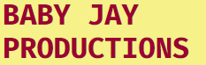

## Introduction

Baby Jay Productions is a website designed to promote the services of a professional audio production company of the same name run by Siobhan Brosnan, a professional in the radio broadcasting and podcasting industry based in Co. Kerry, Ireland. The objective of the website is to clearly communicate the breadth and depth of Siobhan's technical and creative services to brands, companies and individuals looking to set up their own podcasts.  From reading the website, users will understand and appreciate the value that Siobhan could bring to their business or creative venture, thereby providing Siobhan with new clients. The website presents information in a vibrant and professional manner that is reflective of Siobhan's approach to her work. 

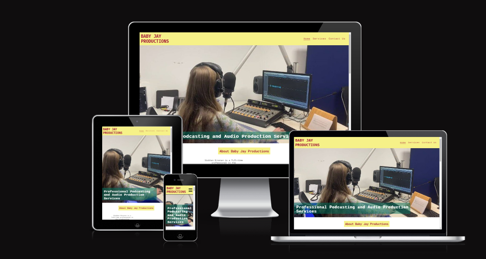

## UX

The primary goal was to create a vibrant, professional website that would provide prospective clients with a thorough and concise overview of Siobhan's skills as a technical and creative consultant in the audio and podcasting industry.

### Colour Scheme

From the outset, I understood that I wanted some bright colours to reflect Siobhan's creativity. However, it was important that the colours would appear suitably muted so as to simultaneously get her professionalism across to the site user, who would be likely to be a prospective client. As such, using the coolors.co website, I initially selected a palette of five colours to be used alongside black (#000000) and white (#FFFFFF).

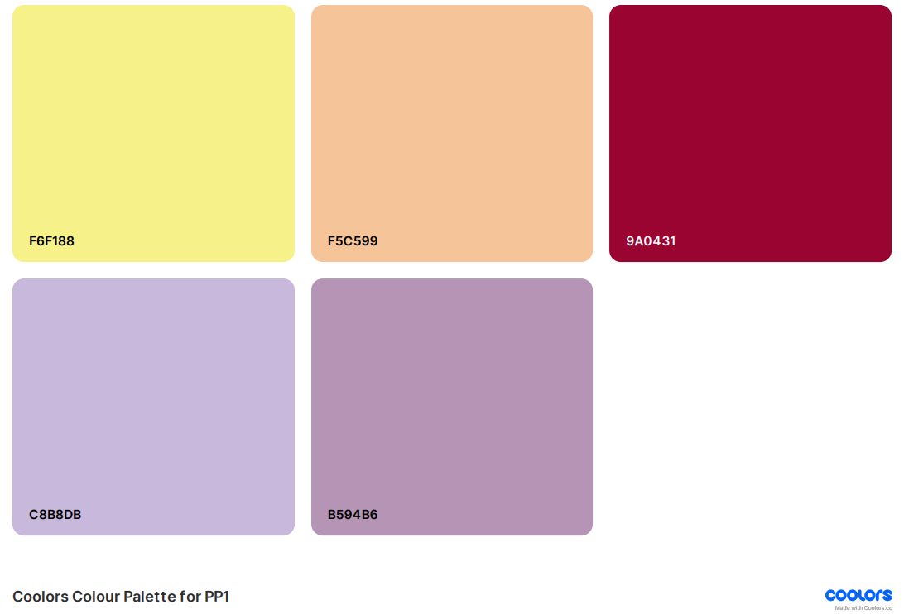

However, after using the Colour Contrast Checker tool on audioeye.com, it was clear to me that the use of lilac (#B594B6) and thistle (#C8B8DB) would be unsuitable, as white (#FFFFFF) text upon these background colours would not meet the minimum score of 4.5 as per the Web Content Accessibility Guidelines (WCAG) 2.1.

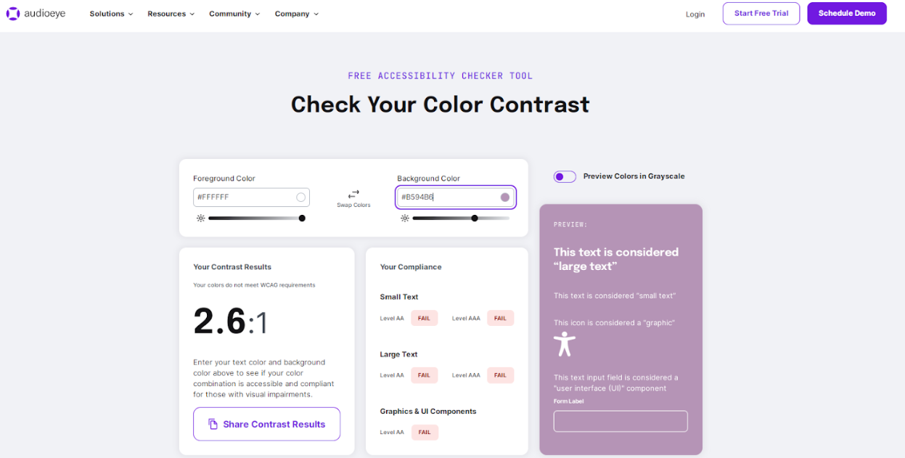

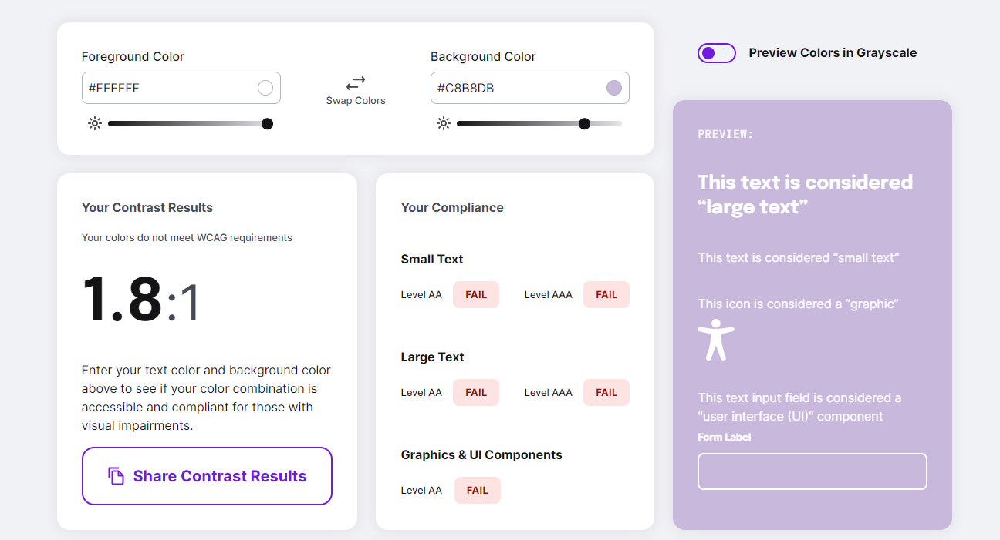

As such, I removed these two colours from my palette and added a dark pine green that would contrast positively with the rest of the palette. This was confirmed to be acceptable in terms of the WCAG 2.1 as shown below:

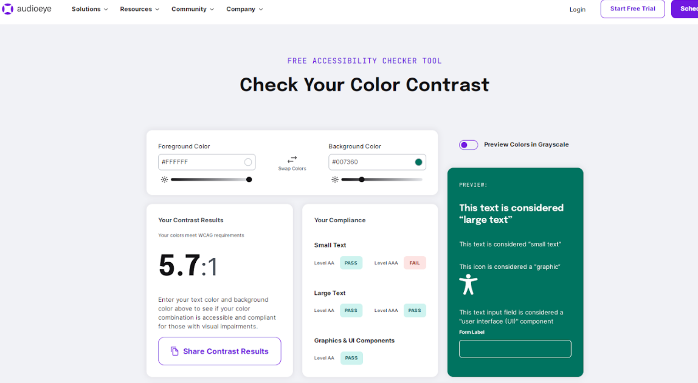

With this change, my colour palette was finalised.  

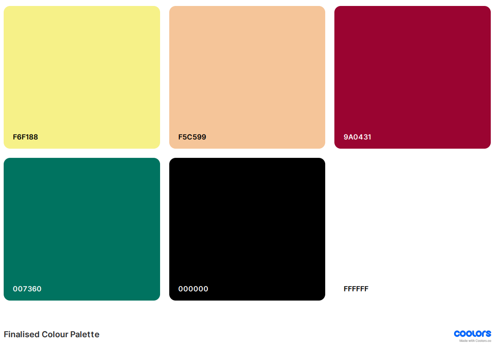

### Typography

I used the fontjoy.com website to find three free Google Fonts that I found to be complementary. 

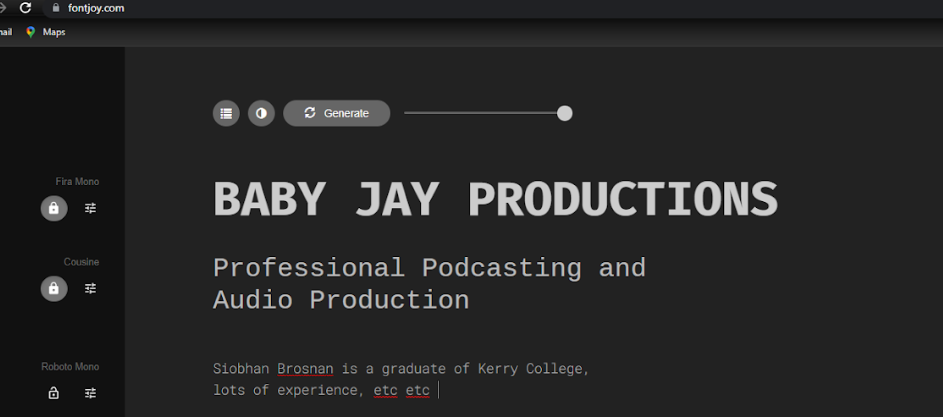

The three fonts selected - Fira Mono, Cousine, and Roboto Mono - are all sans-serif and so are well-suited in terms of their accessibility for screen reading. [Fira Mono](https://fonts.google.com/specimen/Fira+Mono) was used for the logo font; [Cousine](https://fonts.google.com/specimen/Cousine) was used for all sub-headings, while [Roboto Mono](https://fonts.google.com/specimen/Roboto+Mono) was used for paragraphs. Both Cousine and Roboto Mono share a similar, typewriter-style aesthetic that contrasts positively with the thick bold lines of Fira Mono.  

[Font Awesome](https://fontawesome.com) icons were also used throughout the site, such as the social media icons in the footer and above the sub-headings on the Services page.

## User Stories

### New Site Users

- As a new site user, I would like to know the purpose of the website, so that I can discern whether or not it is relevant to me.
- As a new site user, I would like the website to be easily navigable, so that I can easily find the information that I may need.
- As a new site user, I would like to easily return to the home page by clicking the logo in the header, so that I can easily orient myself within the website. 
- As a new site user, I would like the website to have good SEO scores and semantic elements so that I can easily find it through a search engine.
- As a new site user, I would like to be assured that the interactive elements of the website work, so that I may have a positive experience that wouldn't result in frustration. 

### Returning Site Users

- As a returning site user, I would like to know where I can find further information on the business, such as their social media presence. 
- As a returning site user, I would like to know how to contact the business directly for commercial queries.

### Frequent Site Users

- As a frequent site user, I would like the website to be responsive to different screen widths, so that I can easily view it on a variety of devices.

## Wireframes

To follow best practice, wireframes were developed for mobile, tablet, and desktop sizes.
I've used [Balsamiq](https://balsamiq.com/wireframes) to design my site wireframes.

### Mobile Wireframes

 Click here to see the Mobile Wireframes

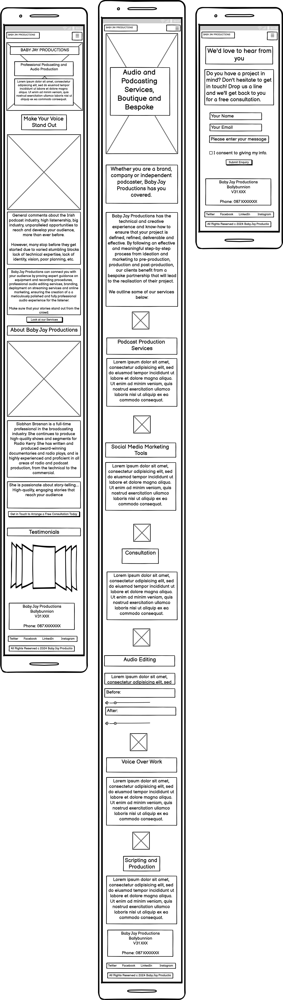

### Tablet Wireframes

 Click here to see the Tablet Wireframes

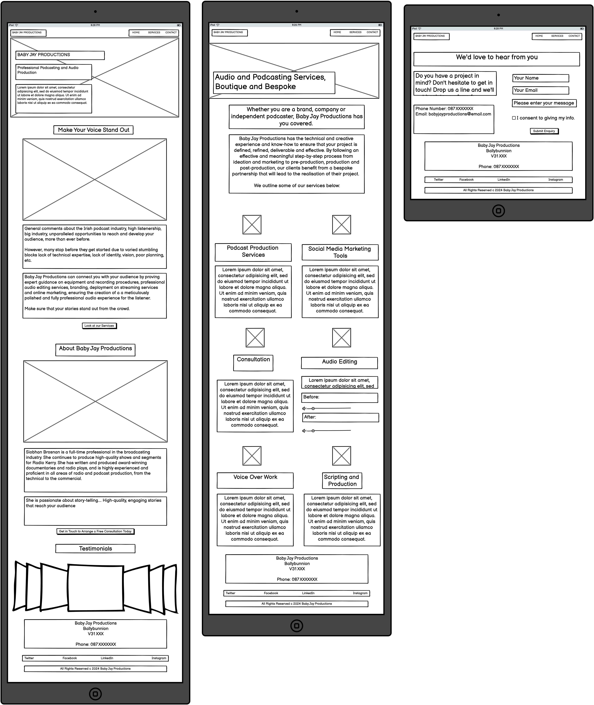

### Desktop Wireframes

 Click here to see the Desktop Wireframes

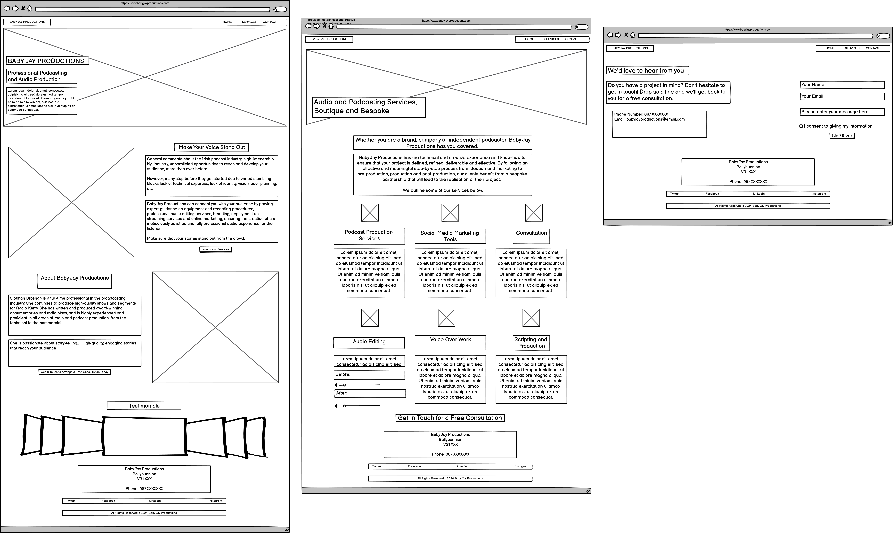

## Features

### Existing Features

#### Logo

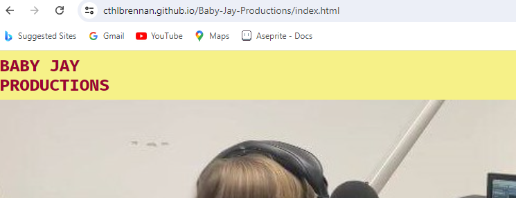

Upon entering the page, the logo is apparent in the top left corner, or the very top of the page if viewed on a mobile screen. This tells the user what website they are on. It is also clickable, allowing users to navigate easily and directly back to the home page from any other page. 

#### Navigation Bar

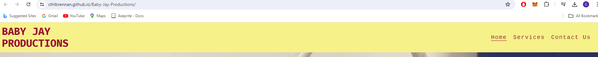

Upon entering the page, it is immediately apparent to the user that there is a menu that provides them links to the pages of the website. This makes the page easily navigable for the user. 

#### Dropdown Menu

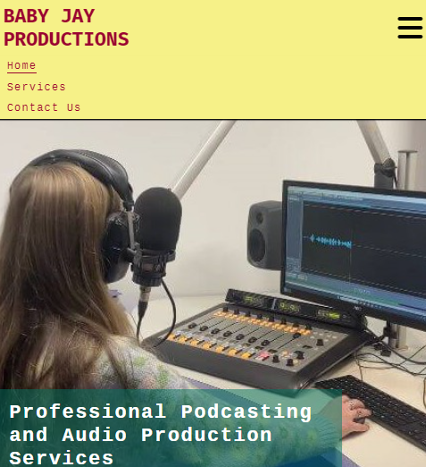

At mobile and tablet screen width, the menu options are accessed through a dropdown menu via a hamburger icon.

#### Menu Options

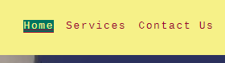

For desktop computers, if the cursor of the mouse is hovered on the menu options, they will respond by changing colour over 0.4 seconds. This level of interactivity lends an air of professionalism to the business, and provides visual engagement to the user, enticing them to explore more of the website and discover more about the business. 

#### Hero Image on Index Page

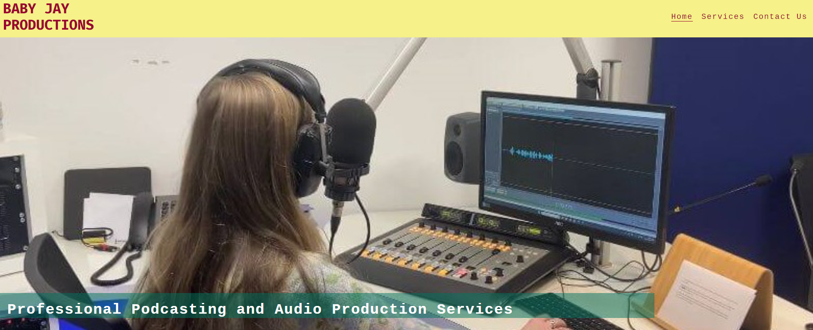

A large image showing Siobhan at work in a recording studio sets the tone for the website, and tells the user about the substance of the business and the industry in which they operate. This is further elucidated by the white text on the slightly transparent green background above the image. 

#### About Section

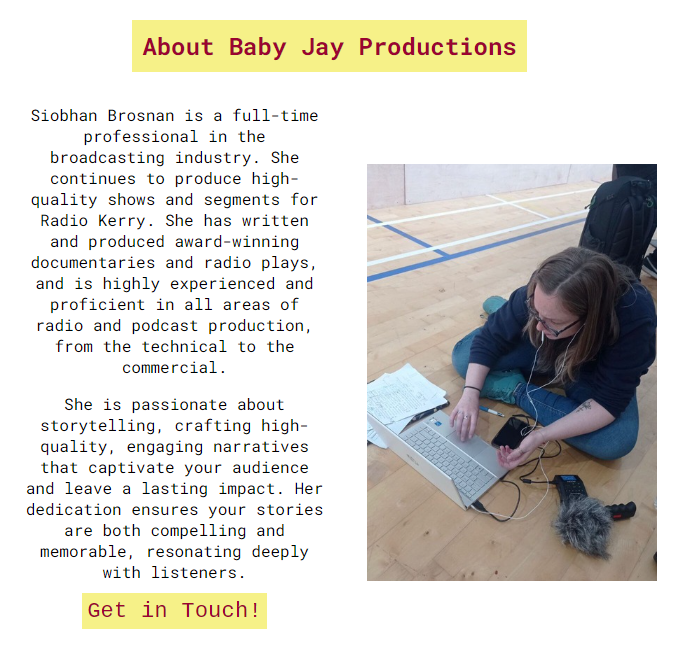

This section provides a concise summary of Siobhan's expertise and experience. The website respects the user's time by cutting right to the core of the business. 

#### Call-to-Action Buttons

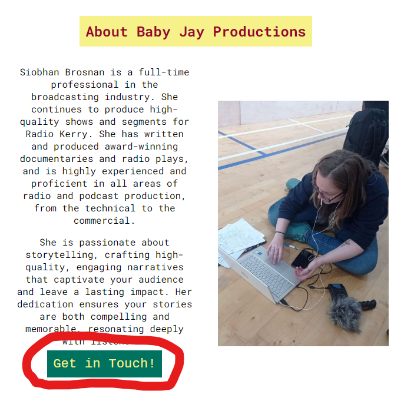

Below the About section, there is a large button which invites the user to click it. This brings the user directly to the Contact Us page. This call-to-action button is a great feature which encourages interaction from the user. It also helps the business, as it encourages potential clients to reach out for a consultation. These are also included underneath the Industry section discussed below, as well as the bottom of the Services page.

#### Industry Section

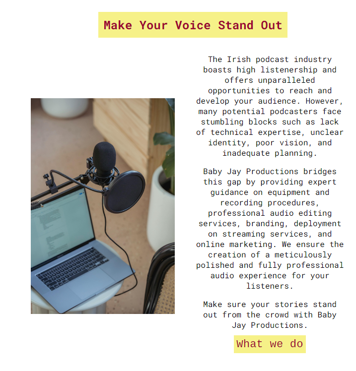

This section gives a synopsis of the podcasting industry in Ireland, while highlighting the need for a professional product that can get ahead of the crowd. Once again, a call-to-action button is included underneath this section, this time leading to the Services page.

#### Testimonials

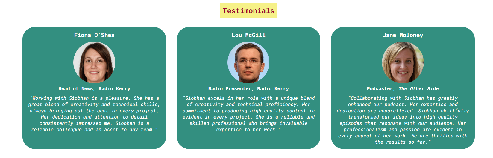

Three testimonials are set out here. At the moment, these images are placeholder AI-generated images taken from the website https://thispersondoesnotexist.com/. Furthermore, the names and comments are fictional and also act as placeholders. 

#### Favicon

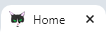

The pages of the website have a favicon of Baby Jay - an illustration of Siobhan's cat which was made on an open-source software called Inkscape. 

#### Footer

The footer is present on every page. It contains contact information (placeholders for email and phone number at the moment) and the logo text in reverse colours. The colours used are a mirror of the header, telling the user visually that they are at the bottom of the page. 

#### Social Media Links

The footer also contains icons from https://www.fontawesome.com. These icons can be linked, sending the user to the corresponding social media website in a new tab. Each icon has an Aria label to promote accessibility. At the moment, the links just lead to the home page of each social media website, but these would eventually lead to Siobhan's social media pages once she has them set up in due course.

#### Copyright

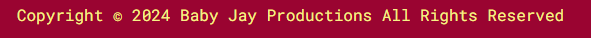

A short sentence regarding copyright is included at the bottom of each page. 

#### Easter Egg Icon

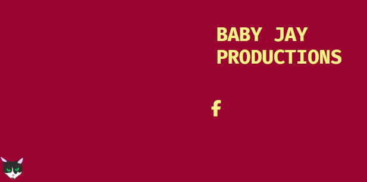

In the bottom left corner of the home page, there is an icon which is the same as that which is used for the favicon. Clicking it leads the user to a hidden page. Once again, this icon has a Aria label to promote accessibility for all users. 

#### Easter Egg Page

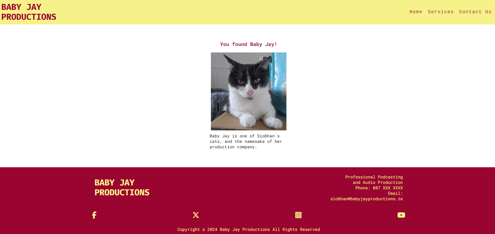

Upon clicking the "easter egg" icon as discussed above, users are led to this page which gives context for the name of the business. The use of an oblique "easter egg" like this gives the website and business an air of creativity and playfulness, while also encouraging users to look thoroughly through the site for any other quirks. 

#### Hero Image on Services Page

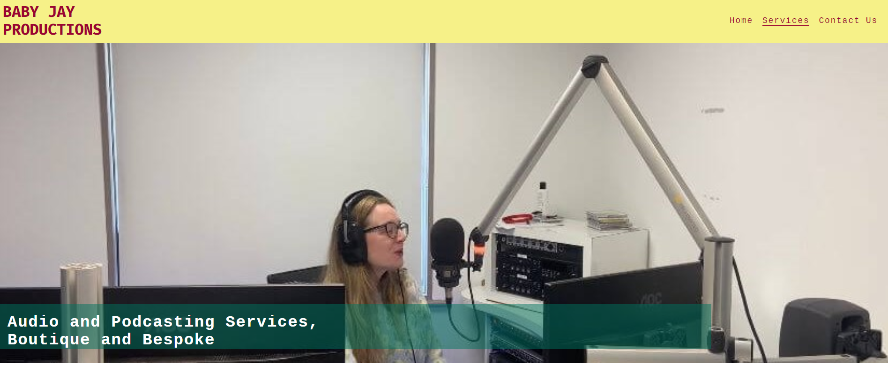

This large image greets the user on the Services page. The image and the accompanying text overlay provides further context on the nature of the business - it is a boutique business that provides custom solutions for the client. Like all other elements of the website, it has been designed to be responsive to different devices. 

#### Services Section

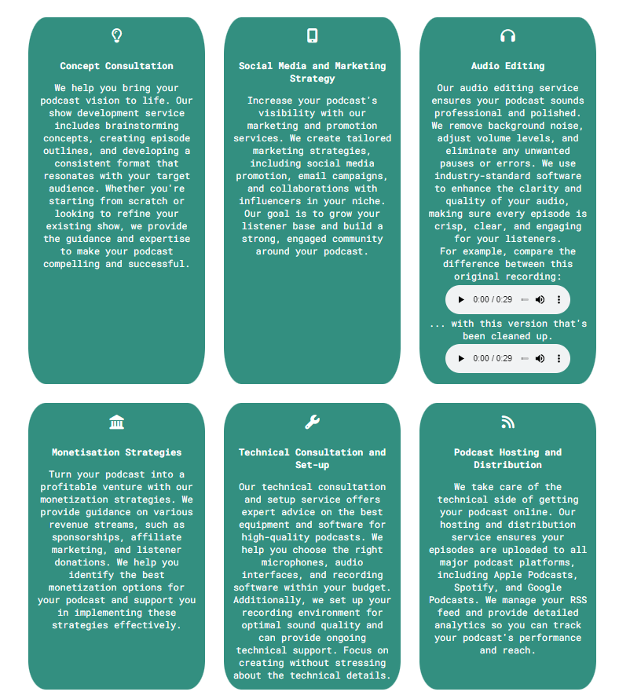

The services page contains a section comprising six boxes, each with an icon from https://fontawesome.com, a headline, and information on a particular service which Siobhan can provide to prospective clients. This gives users a strong idea of the breadth of skills that Siobhan has, and how she could be of assistance professionally to them.  

#### Interactive Audio

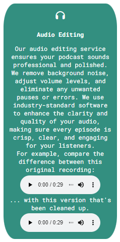

The Audio Editing box of the services section contains two audio clips. These are not autoplaying upon the opening of the page, as per best UX practice. The user can use the controls to hear the recordings. The first plays a poor quality piece of audio, the second plays the same audio but restored, thereby showing Siobhan's skill at audio repair to the user. 

#### Contact Form

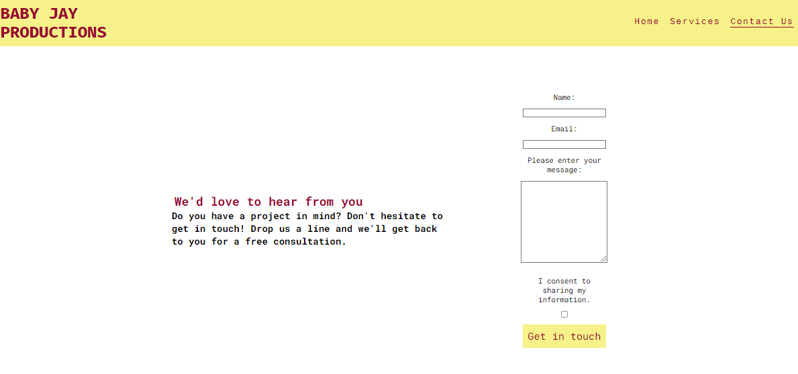

The page has a fully responsive contact form. 

Each of the fields must be complete in order for a form to be submitted, as shown below:

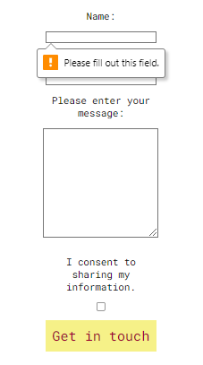

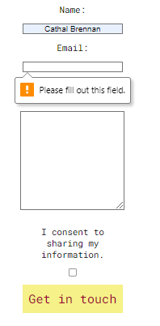

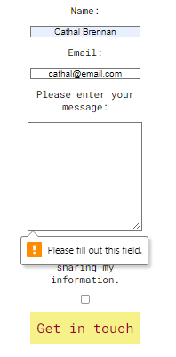

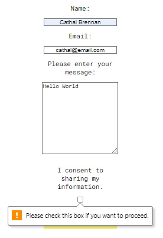

This ensures that Siobhan wouldn't have to deal with incomplete messages that would lack vital contact information, creating a situation where she could miss out on work. This also helps the user avoid forgetting to provide their contact information on their part. 

#### Form Submission Page

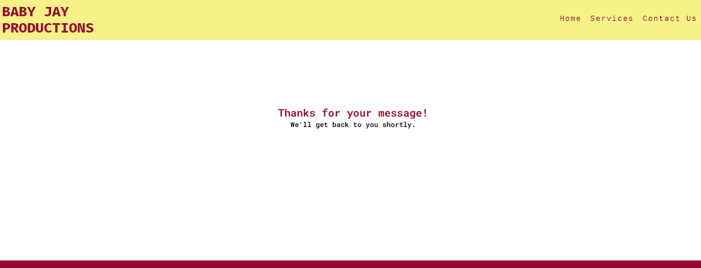

The page appears upon submission of the form. It appears for five seconds, before sending the user back to the home page. This assures the user that their message has been sent. At the moment, there is no database set up for storing messages - this would need to be set up later.

#### 404 Page

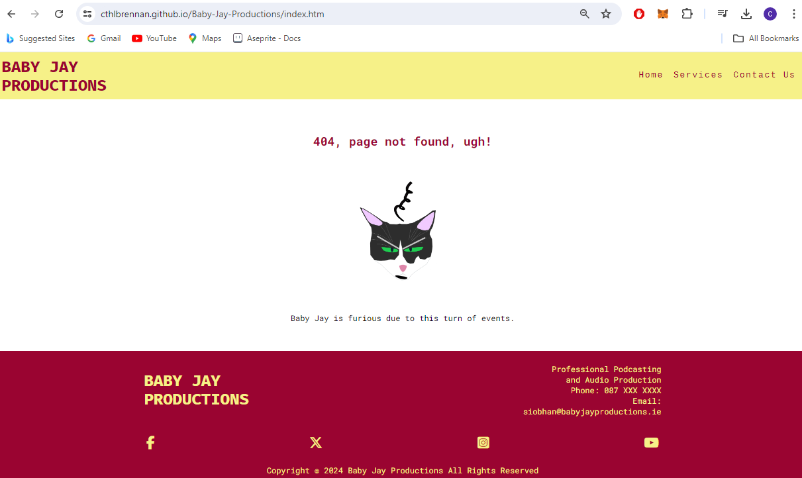

If there is a 404 error, the user will be sent to the 404 page. This page features a variation of the illustration, with Baby Jay having an angry expression. 

### Future Features

- SQL Database
    - This will be needed in order to store messages sent through the contact form.
- Testimonials
    - Testimonials and images from real people that Siobhan works with will be used within the testimonial section, replacing the current fictional placeholders. Incorporating a carousel feature for this section would also lend additional interactivity and dynamism to the website that would raise the level of professionalism.  
- Social Media Links
    - The links will lead to Siobhan's relevant socials, not placeholders. 
- Photos
    - Higher-quality resolution photographs would be needed in the future, especially for the hero images.

## Tools & Technologies Used

-  used to generate README and TESTING templates.
-  used for version control. (`git add`, `git commit`, `git push`)
-  used for secure online code storage.
-  used as a cloud-based IDE for development.
-  used for the main site content.
-  used for the main site design and layout.
-  used for hosting the deployed front-end site.
-  used for creating wireframes.
-  used for the icons.
-  used to help debug, troubleshoot, and explain things.

I have also Inkscape for creating the Baby Jay Illustration, and Phind for some explanation of HTML and CSS concepts. 

## Testing

> [!NOTE]  
> For all testing, please refer to the [TESTING.md](TESTING.md) file.

## Deployment

The site was deployed to GitHub Pages. The steps to deploy are as follows:

- In the [GitHub repository](https://github.com/cthlbrennan/Baby-Jay-Productions), navigate to the Settings tab 
- From the source section drop-down menu, select the **Main** Branch, then click "Save".
- The page will be automatically refreshed with a detailed ribbon display to indicate the successful deployment.

The live link can be found [here](https://cthlbrennan.github.io/Baby-Jay-Productions)

### Local Deployment

This project can be cloned or forked in order to make a local copy on your own system.

#### Cloning

You can clone the repository by following these steps:

1. Go to the [GitHub repository](https://github.com/cthlbrennan/Baby-Jay-Productions) 
2. Locate the Code button above the list of files and click it 
3. Select if you prefer to clone using HTTPS, SSH, or GitHub CLI and click the copy button to copy the URL to your clipboard
4. Open Git Bash or Terminal
5. Change the current working directory to the one where you want the cloned directory
6. In your IDE Terminal, type the following command to clone my repository:
	- `git clone https://github.com/cthlbrennan/Baby-Jay-Productions.git`
7. Press Enter to create your local clone.

Alternatively, if using Gitpod, you can click below to create your own workspace using this repository.

Please note that in order to directly open the project in Gitpod, you need to have the browser extension installed.
A tutorial on how to do that can be found [here](https://www.gitpod.io/docs/configure/user-settings/browser-extension).

#### Forking

By forking the GitHub Repository, we make a copy of the original repository on our GitHub account to view and/or make changes without affecting the original owner's repository.
You can fork this repository by using the following steps:

1. Log in to GitHub and locate the [GitHub Repository](https://github.com/cthlbrennan/Baby-Jay-Productions)
2. At the top of the Repository (not top of page) just above the "Settings" Button on the menu, locate the "Fork" Button.
3. Once clicked, you should now have a copy of the original repository in your own GitHub account!

### Local VS Deployment

To my knowledge, there is no difference between the local version on Gitpod and the live deployed version on Github Pages.

## Credits

### Content

| Source | Location | Notes |
| --- | --- | --- |
| [Markdown Builder](https://tim.2bn.dev/markdown-builder) | README and TESTING | tool to help generate the Markdown files |
| [Code Institute](codeinstitute.net) | Entire Site | Some stucture and code taken from Love Running Walkthrough Project and HTML and CSS Essentials Modules |
| [Geeks for Geeks](https://www.geeksforgeeks.org/html-how-to-add-testimonials) | Index.html | Code formed basis for testimonial section |
| [Flexbox Froggy](https://flexboxfroggy.com/) | entire site | modern responsive layouts |
| [Free Code Camp](https://www.freecodecamp.org/news/how-to-center-an-image-in-a-div-css/) | index.html | use of align-items:stretch declaration based on the article, 'CSS Image Centering – How to Center an Image in a Div'
|[Audioeye](https://audioeye.com) | entire site | colour contrast tool 
|[UI.dev](https://ui.dev/amiresponsive) | entire site | Am I Responsive tool
|[Coolors](https://coolors.co) | entire site | Palette Generator Tool
|[Fontjoy](https://fontjoy.com) | entire site | Font Pairing Tool

### Media

| Source | Location | Type | Notes |
| --- | --- | --- | --- |
| Created by Myself on Inkscape | entire site | image | favicon on all pages |
| Created by Myself on Inkscape | 404.html | image | angry baby jay illustration |
| Siobhan Brosnan |Index.html and services.html | image | hero images and about section image|
| Siobhan Brosnan |services.html | audio | audio repair clips
| Siobhan Brosnan |easteregg.html | image | image of Baby Jay |
| [Google Fonts](https://fonts.google.com/) | product page | fonts | further information and links to fonts provided above in Typography section|
| [Pexels](https://www.pexels.com/photo/microphone-on-tripod-attached-to-laptop-in-studio-6953871/) | index.html | image | image of microphone and laptop in industry section |
| [This Person Does Not Exist](https://thispersondoesnotexist.com/) | index.html | image | AI-generated images for testimonials section |
| [Font Awesome](https://fontawesome.com) | index.html and services.html | image | icons used in social media links and services section |
| [TinyPNG](https://tinypng.com) | entire site | image | tool for image compression |

### Acknowledgements

Thanks to Tim Nelson for his help and guidance. 
Thanks to Marko Tot for same. 
Thanks to Siobhan for allowing me to make her a website for free. 