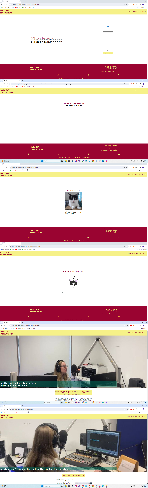
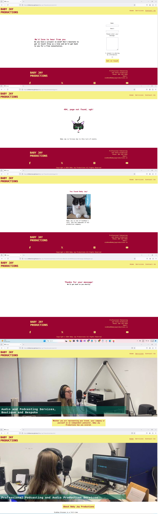
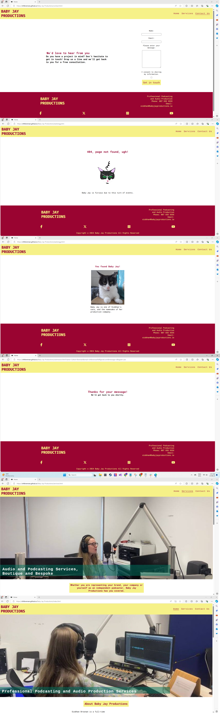
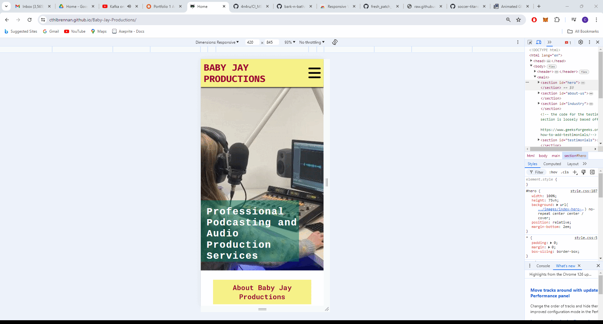
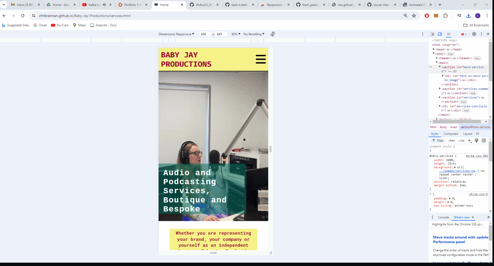
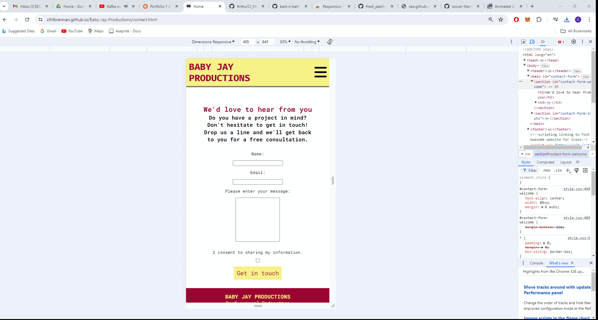
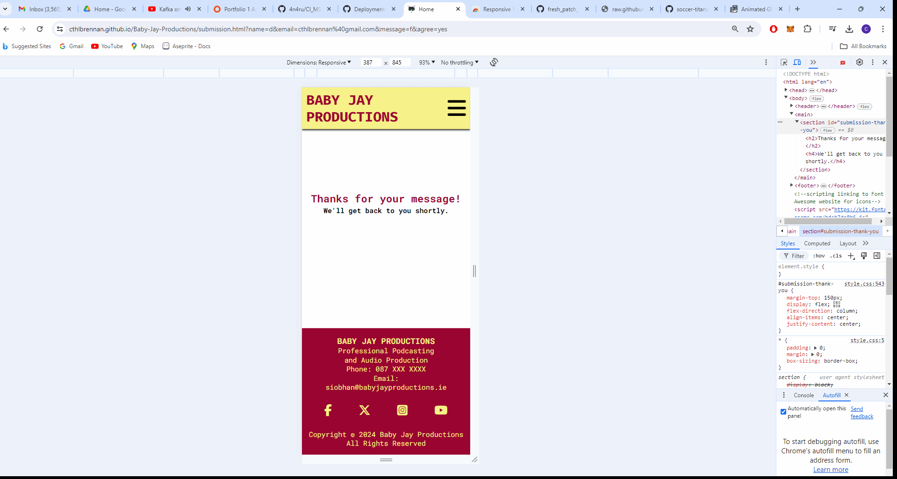
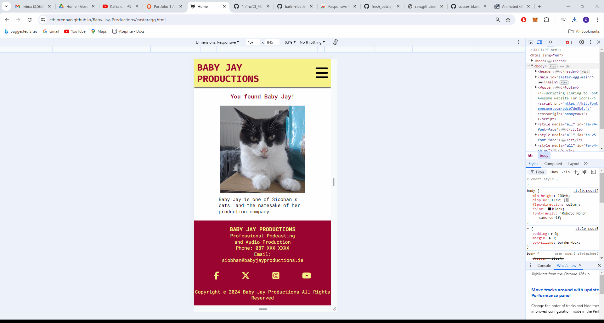
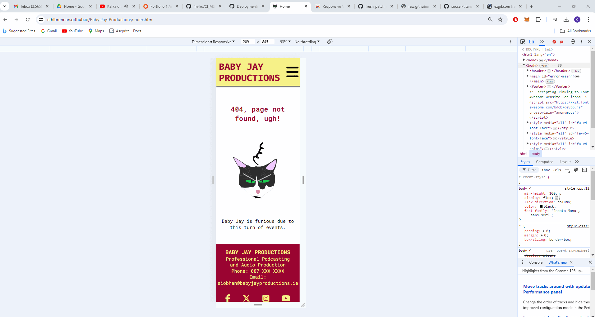

# Testing

> [!NOTE]  
> Return back to the [README.md](README.md) file.

## Compatibility 

The compatibility of all six pages of the website have been tested on different browsers including Google Chrome, Microsoft Edge and Mozilla Firefox. 

 Click here to see Compatibility with Google Chrome 

 Click here to see Compatibility with Mozilla Firefox 

 Click here to see Compatibility with Microsoft Edge 

It is evident that the website has compatibility with multiple browsers.

## Responsiveness

### index.html 

As can be seen below, index.html responds well when tested on different device sizes. At mobile screen-width, there is a hamburger icon/dropdown menu which works effectively. When the screen has the width of a tablet, the hamburger icon is no longer in view, and each of the menu options become visible within the navigation bar. The responsiveness of the About and Industry sections is evident, as is that of the testimonial section. The hero image also remains centered and covers the full width of the screen at any time. 

### services.html

The hero image for the services.html page also remains centered and reacts as expected. The dropdown menu and nav bar also respond as expected, as per index.html. The six boxes of the services section are lined up in a column in mobile view, then in two columns of three at tablet width, then three columns of two for laptop and desktop. We can also see in the .gif below that the various elements of the footer, including the contact details, the logo, and the social media link icons expand and retract proportionate to the width of the screen, always filling the full width of the footer in a responsive and proportionate manner.  

### contact.html

This main section of this page is comprised of two main elements - the text inviting users to submit a query, and the form itself. At mobile and tablet width, these elements are stacked on one another in a column. At laptop and desktop width, they are aligned in a row, side-by-side. They respond proportionately to the width of the screen. 

### submission.html

This is a very simple page, with one small body of text comprising a heading and a paragraph. It remains centered within the page at every screen width, performing well in its role. 

### easteregg.html

Once again, a very simple page which can be seen below to respond well to different screen widths. 

### 404.html

Again, this is a very simple page which can be seen below to respond proportionately to different widths.  

## Manual Testing

Below, I provide the results of having manually tested each of the website's features.

|Page Feature|Action(s)|Expected result|Tested|Passed/Failed|
|-------|-------|------|------|-------------|
Logo in Header/Nav Bar |Clicking on it |Go to index.html from any other page in the website|Yes|Pass|        |
|Navigation Bar / Menu Options |Look at menu options |Currently viewed page is underlined (doesn’t include submission.html, 404.html or easteregg.html pages)|Yes|Pass|        
|Navbar / Menu |Hover cursor on menu items on desktop |Item underlined when cursor hover over it, changes colour and background colour over 0.4 seconds |Yes   |Pass  |          
|Navbar / Menu |Press hamburger menu at mobile and tablet screen widths   |Menu dropdown opens when clicked   |Yes   |Pass |            
|Home menu option |Click it   |Clicking Home returns to home (index.html) page |Yes   |Pass  |            
|Services menu option |Click it   |Clicking Services sends to services.html |Yes   |Pass  |           
|Contact Us menu option |Click it   |Clicking Contact Us sends user to contact.html |Yes   |Pass  |            
|Hero Image on index.html |Increasing screen width in DevTools|This photo remains centered and covers the width of the screen regardless of screen width   |Yes   |Pass  |           
|Hero Image on services.html |Increasing screen width in DevTools|This photo remains centered and covers the width of the screen regardless of screen width  |Yes   |Pass  | 
|Call-to-Action Button, About Section, index.html |Clicking on it|Sends user to Contact Us page, changes colour at desktop due to hover psuedoclass  |Yes   |Pass  | 
|Call-to-Action Button, Industry Section, index.html |Clicking on it|Sends user to Services page, changes colour at desktop due to hover psuedoclass  |Yes   |Pass  | 
|Call-to-Action Button, Services section, services.html |Clicking on it|Sends user to Contact Us page, changes colour at desktop due to hover psuedoclass  |Yes   |Pass  |
|Testimonials Section, index.html |Change screen width|Responsive design  |Yes   |Pass  | 
|Social Media links in Footer      |Click on icons   |Clicked link sends user to homepage of respective social media website in a new tab  |Yes   |Pass  |          
|Alt-text    |Intentionally break file path of image on index.html  |Image will not appear due to a broken file path, but alt-text will display instead in its place|Yes   |Pass  |
|Favicon |Look at it  |It's on the browser tab for every page of the website  |Yes   |Pass         |         
|Footer |Increase and decrease screen width  |Elements in footer grow and shrink proportionately  |Yes   |Pass         |       
|Easter Egg Icon |Click on it  |Sends user to easteregg.html  |Yes   |Pass         |        
|Audio clips, services.html  |Use controls   |The various controls (play, pause, scroll) will work  |Yes   |Pass |             
|Contact Form, call-to-action button | Hover over it at desktop screen width|It will change colour over a period of 0.4 seconds  |Yes   |Pass         
|Contact Form | Click "Get in Touch" call-to-action button without filling in "Name" field| Text will appear telling me to fill in required "Name" field  |Yes   |Pass         | 
|Contact Form | Click "Get in Touch" call-to-action button without filling in "Email" field| Text will appear telling me to fill in required "Email" field  |Yes   |Pass         |  
|Contact Form | Click "Get in Touch" call-to-action button without filling "Email" field with valid email address syntax| Text will appear telling me to fill "Email" field with a valid email address  |Yes   |Pass         | 
|Contact Form | Click "Get in Touch" call-to-action button without clicking consent checkbox| Text will appear telling me to check the required checkbox before proceeding  |Yes   |Pass         | 
|Contact Form | Click "Get in Touch" call-to-action button with all fields correctly filled in and checkbox ticked| User sent to submission.html |Yes   |Pass         | |submission.html | Fill out form on contact.html correctly to get to page| After five seconds, user sent to index.html automatically  |Yes   |Pass         | 
|404.html | Intentionally go to incorrectly spelt address i.e. https://cthlbrennan.github.io/Baby-Jay-Productions/index.htm, with the "l" missing at the end| This intentional mistake will lead user to 404.html  |Yes   |Pass         | 
|404.html | Go to address which I know doesn't exist in file directory i.e. https://cthlbrennan.github.io/Baby-Jay-Productions/whoops.html| This intentional mistake will lead user to 404.html  |Yes   |Pass         | 

I am confident that the features of my website work correctly. 

## Code Validation

🛑🛑🛑🛑🛑🛑🛑🛑🛑🛑-START OF NOTES (to be deleted)

Use the space to discuss code validation for any of your own code files (where applicable).
You are not required to validate external libraries/frameworks, such as imported Bootstrap, Materialize, Font Awesome, etc.

**IMPORTANT**: You must provide a screenshot for each file you validate.

**PRO TIP**: Always validate the live site pages, not your local code. There could be subtle/hidden differences.

🛑🛑🛑🛑🛑🛑🛑🛑🛑🛑-END OF NOTES (to be deleted)

### HTML

I have used the recommended [HTML W3C Validator](https://validator.w3.org) to validate all of my HTML files.

| Directory | File | Screenshot | Notes |
| --- | --- | --- | --- |
|  | 404.html |  | |
|  | contact.html |  | |
|  | easteregg.html |  | |
|  | index.html |  | |
|  | services.html |  | |
|  | submission.html |  | |

### CSS

I have used the recommended [CSS Jigsaw Validator](https://jigsaw.w3.org/css-validator) to validate all of my CSS files.

| Directory | File | Screenshot | Notes |
| --- | --- | --- | --- |
| assets | style.css |  | |

## Lighthouse Audit

🛑🛑🛑🛑🛑🛑🛑🛑🛑🛑-START OF NOTES (to be deleted)

Use this space to discuss testing the live/deployed site's Lighthouse Audit reports.
Avoid testing the local version (especially if developing in Gitpod), as this can have knock-on effects of performance.

If you don't have Lighthouse in your Developer Tools,
it can be added as an [extension](https://chrome.google.com/webstore/detail/lighthouse/blipmdconlkpinefehnmjammfjpmpbjk).

Don't just test the home page (unless it's a single-page application).
Make sure to test the Lighthouse Audit results for all of your pages.

**IMPORTANT**: You must provide screenshots of the results, to "prove" that you've actually tested them.

Sample Lighthouse testing documentation:

🛑🛑🛑🛑🛑🛑🛑🛑🛑🛑-END OF NOTES (to be deleted)

I've tested my deployed project using the Lighthouse Audit tool to check for any major issues.

| Page | Mobile | Desktop | Notes |
| --- | --- | --- | --- |
| Home |  |  | Some minor warnings |
| About |  |  | Some minor warnings |
| Gallery |  |  | Slow response time due to large images |
| x | x | x | repeat for any other tested pages/sizes |

## User Story Testing

🛑🛑🛑🛑🛑🛑🛑🛑🛑🛑-START OF NOTES (to be deleted)

Testing user stories is actually quite simple, once you've already got the stories defined on your README.

Most of your project's **features** should already align with the **user stories**,
so this should as simple as creating a table with the user story, matching with the re-used screenshot
from the respective feature.

🛑🛑🛑🛑🛑🛑🛑🛑🛑🛑-END OF NOTES (to be deleted)

| User Story | Screenshot |
| --- | --- |
| As a new site user, I would like to ____________, so that I can ____________. |  |
| As a new site user, I would like to ____________, so that I can ____________. |  |
| As a new site user, I would like to ____________, so that I can ____________. |  |
| As a returning site user, I would like to ____________, so that I can ____________. |  |
| As a returning site user, I would like to ____________, so that I can ____________. |  |
| As a returning site user, I would like to ____________, so that I can ____________. |  |
| As a site administrator, I should be able to ____________, so that I can ____________. |  |
| As a site administrator, I should be able to ____________, so that I can ____________. |  |
| As a site administrator, I should be able to ____________, so that I can ____________. |  |
| repeat for all remaining user stories | x |

## Bugs

🛑🛑🛑🛑🛑🛑🛑🛑🛑🛑-START OF NOTES (to be deleted)

This section is primarily used for JavaScript and Python applications,
but feel free to use this section to document any HTML/CSS bugs you might run into.

It's very important to document any bugs you've discovered while developing the project.
Make sure to include any necessary steps you've implemented to fix the bug(s) as well.

**PRO TIP**: screenshots of bugs are extremely helpful, and go a long way!

🛑🛑🛑🛑🛑🛑🛑🛑🛑🛑-END OF NOTES (to be deleted)

- JS Uncaught ReferenceError: `foobar` is undefined/not defined

    

    - To fix this, I _____________________.

- JS `'let'` or `'const'` or `'template literal syntax'` or `'arrow function syntax (=>)'` is available in ES6 (use `'esversion: 11'`) or Mozilla JS extensions (use moz).

    

    - To fix this, I _____________________.

- Python `'ModuleNotFoundError'` when trying to import module from imported package

    

    - To fix this, I _____________________.

- Django `TemplateDoesNotExist` at /appname/path appname/template_name.html

    

    - To fix this, I _____________________.

- Python `E501 line too long` (93 > 79 characters)

    

    - To fix this, I _____________________.

## Unfixed Bugs

🛑🛑🛑🛑🛑🛑🛑🛑🛑🛑-START OF NOTES (to be deleted)

You will need to mention unfixed bugs and why they were not fixed.
This section should include shortcomings of the frameworks or technologies used.
Although time can be a big variable to consider, paucity of time and difficulty understanding
implementation is not a valid reason to leave bugs unfixed.

If you've identified any unfixed bugs, no matter how small, be sure to list them here.
It's better to be honest and list them, because if it's not documented and an assessor finds the issue,
they need to know whether or not you're aware of them as well, and why you've not corrected/fixed them.

Some examples:

🛑🛑🛑🛑🛑🛑🛑🛑🛑🛑-END OF NOTES (to be deleted)

- On devices smaller than 375px, the page starts to have `overflow-x` scrolling.

    

    - Attempted fix: I tried to add additional media queries to handle this, but things started becoming too small to read.

- For PP3, when using a helper `clear()` function, any text above the height of the terminal does not clear, and remains when you scroll up.

    

    - Attempted fix: I tried to adjust the terminal size, but it only resizes the actual terminal, not the allowable area for text.

- When validating HTML with a semantic `section` element, the validator warns about lacking a header `h2-h6`. This is acceptable.

    

    - Attempted fix: this is a known warning and acceptable, and my section doesn't require a header since it's dynamically added via JS.

🛑🛑🛑🛑🛑🛑🛑🛑🛑🛑-START OF NOTES (to be deleted)

If you legitimately cannot find any unfixed bugs or warnings, then use the following sentence:

🛑🛑🛑🛑🛑🛑🛑🛑🛑🛑-END OF NOTES (to be deleted)

> [!NOTE]  
> There are no remaining bugs that I am aware of.
