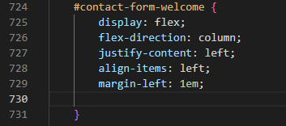
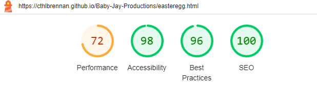
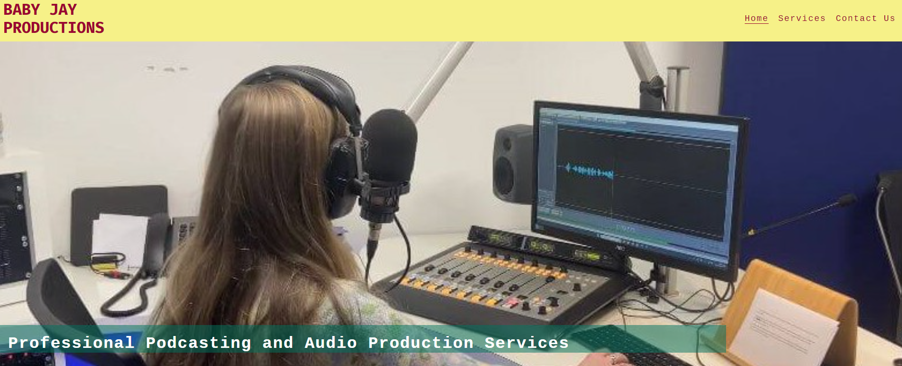
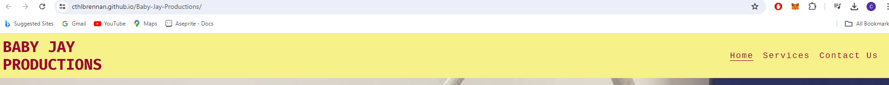
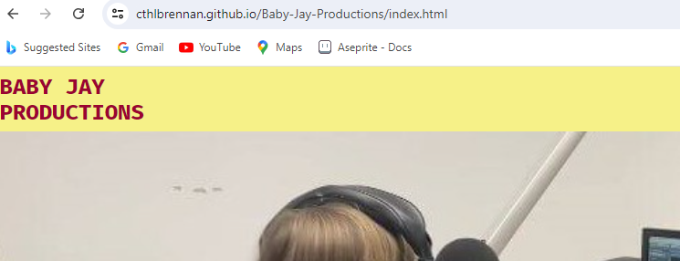
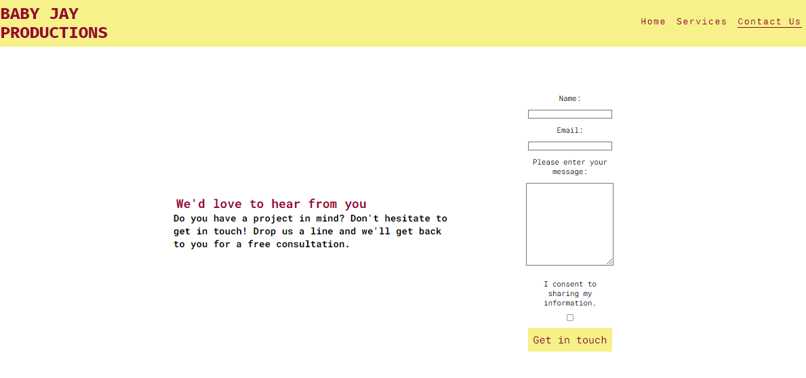
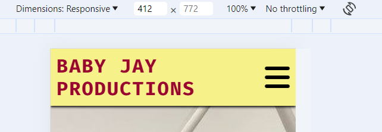

# Testing

> [!NOTE]  
> Return back to the [README.md](README.md) file.

## Compatibility 

The compatibility of all six pages of the website have been tested on different browsers including Google Chrome, Microsoft Edge and Mozilla Firefox. 

 Click here to see Compatibility with Google Chrome 

 Click here to see Compatibility with Mozilla Firefox 

 Click here to see Compatibility with Microsoft Edge 

It is evident that the website has compatibility with multiple browsers.

## Responsiveness

### index.html 

As can be seen below, index.html responds well when tested on different device sizes. At mobile screen-width, there is a hamburger icon/dropdown menu which works effectively. When the screen has the width of a tablet, the hamburger icon is no longer in view, and each of the menu options become visible within the navigation bar. The responsiveness of the About and Industry sections is evident, as is that of the testimonial section. The hero image also remains centered and covers the full width of the screen at any time. 

### services.html

The hero image for the services.html page also remains centered and reacts as expected. The dropdown menu and nav bar also respond as expected, as per index.html. The six boxes of the services section are lined up in a column in mobile view, then in two columns of three at tablet width, then three columns of two for laptop and desktop. We can also see in the .gif below that the various elements of the footer, including the contact details, the logo, and the social media link icons expand and retract proportionate to the width of the screen, always filling the full width of the footer in a responsive and proportionate manner.  

### contact.html

This main section of this page is comprised of two main elements - the text inviting users to submit a query, and the form itself. At mobile and tablet width, these elements are stacked on one another in a column. At laptop and desktop width, they are aligned in a row, side-by-side. They respond proportionately to the width of the screen. 

### submission.html

This is a very simple page, with one small body of text comprising a heading and a paragraph. It remains centered within the page at every screen width, performing well in its role. 

### easteregg.html

Once again, a very simple page which can be seen below to respond well to different screen widths. 

### 404.html

Again, this is a very simple page which can be seen below to respond proportionately to different widths.  

## Manual Testing

Below, I provide the results of having manually tested each of the website's features.

|Page Feature|Action(s)|Expected result|Tested|Passed/Failed|
|-------|-------|------|------|-------------|
Logo in Header/Nav Bar |Clicking on it |Go to index.html from any other page in the website|Yes|Pass|        |
|Navigation Bar / Menu Options |Look at menu options |Currently viewed page is underlined (doesn’t include submission.html, 404.html or easteregg.html pages)|Yes|Pass|        
|Navbar / Menu |Hover cursor on menu items on desktop |Item underlined when cursor hover over it, changes colour and background colour over 0.4 seconds |Yes   |Pass  |          
|Navbar / Menu |Press hamburger menu at mobile and tablet screen widths   |Menu dropdown opens when clicked   |Yes   |Pass |            
|Home menu option |Click it   |Clicking Home returns to home (index.html) page |Yes   |Pass  |            
|Services menu option |Click it   |Clicking Services sends to services.html |Yes   |Pass  |           
|Contact Us menu option |Click it   |Clicking Contact Us sends user to contact.html |Yes   |Pass  |            
|Hero Image on index.html |Increasing screen width in DevTools|This photo remains centered and covers the width of the screen regardless of screen width   |Yes   |Pass  |           
|Hero Image on services.html |Increasing screen width in DevTools|This photo remains centered and covers the width of the screen regardless of screen width  |Yes   |Pass  | 
|Call-to-Action Button, About Section, index.html |Clicking on it|Sends user to Contact Us page, changes colour at desktop due to hover psuedoclass  |Yes   |Pass  | 
|Call-to-Action Button, Industry Section, index.html |Clicking on it|Sends user to Services page, changes colour at desktop due to hover psuedoclass  |Yes   |Pass  | 
|Call-to-Action Button, Services section, services.html |Clicking on it|Sends user to Contact Us page, changes colour at desktop due to hover psuedoclass  |Yes   |Pass  |
|Testimonials Section, index.html |Change screen width|Responsive design  |Yes   |Pass  | 
|Social Media links in Footer      |Click on icons   |Clicked link sends user to homepage of respective social media website in a new tab  |Yes   |Pass  |          
|Alt-text    |Intentionally break file path of image on index.html  |Image will not appear due to a broken file path, but alt-text will display instead in its place|Yes   |Pass  |
|Favicon |Look at it  |It's on the browser tab for every page of the website  |Yes   |Pass         |         
|Footer |Increase and decrease screen width  |Elements in footer grow and shrink proportionately  |Yes   |Pass         |       
|Easter Egg Icon |Click on it  |Sends user to easteregg.html  |Yes   |Pass         |        
|Audio clips, services.html  |Use controls   |The various controls (play, pause, scroll) will work  |Yes   |Pass |             
|Contact Form, call-to-action button | Hover over it at desktop screen width|It will change colour over a period of 0.4 seconds  |Yes   |Pass         
|Contact Form | Click "Get in Touch" call-to-action button without filling in "Name" field| Text will appear telling me to fill in required "Name" field  |Yes   |Pass         | 
|Contact Form | Click "Get in Touch" call-to-action button without filling in "Email" field| Text will appear telling me to fill in required "Email" field  |Yes   |Pass         |  
|Contact Form | Click "Get in Touch" call-to-action button without filling "Email" field with valid email address syntax| Text will appear telling me to fill "Email" field with a valid email address  |Yes   |Pass         | 
|Contact Form | Click "Get in Touch" call-to-action button without clicking consent checkbox| Text will appear telling me to check the required checkbox before proceeding  |Yes   |Pass         | 
|Contact Form | Click "Get in Touch" call-to-action button with all fields correctly filled in and checkbox ticked| User sent to submission.html |Yes   |Pass         | |submission.html | Fill out form on contact.html correctly to get to page| After five seconds, user sent to index.html automatically  |Yes   |Pass         | 
|404.html | Intentionally go to incorrectly spelt address i.e. https://cthlbrennan.github.io/Baby-Jay-Productions/index.htm, with the "l" missing at the end| This intentional mistake will lead user to 404.html  |Yes   |Pass         | 
|404.html | Go to address which I know doesn't exist in file directory i.e. https://cthlbrennan.github.io/Baby-Jay-Productions/whoops.html| This intentional mistake will lead user to 404.html  |Yes   |Pass         | 

I am confident that the features of my website work correctly. 

## Code Validation

### HTML

I have used the recommended [HTML W3C Validator](https://validator.w3.org) to validate all of my HTML files.

| File | Screenshot | 
| --- | --- |
| 404.html |  |
| contact.html |  |
| easteregg.html |  |
| index.html |  |
| services.html |  |
| submission.html |  |

### CSS

I have used the recommended [CSS Jigsaw Validator](https://jigsaw.w3.org/css-validator) to validate my CSS file.

Initially, I had two errors with my CSS Validation. 

One error related to a missing comma between "Fira Mono" and "sans-serif" in a rule on line 269.

This was the fix:

The second error related to the wrong use of "align-items:left" for a rule on line 724.

The fix was just to remove this line altogether, which had no effect on the styling of the relevant element in contact.html:

As can be seen below, my CSS file was subsequently validated with no errors.

| File | Screenshot |
| --- | --- |
| style.css |  | |

## Lighthouse Audit

I've tested my deployed project using the Lighthouse Audit tool to check for any major issues.

| Page | Mobile | Desktop | Notes |
| --- | --- | --- | --- |
| Home |  |  | Minor warnings for performance on mobile and desktop |
| Services |  |  | A minor warning for performance on mobile, good performance on desktop |
| Contact Us |  |  | Good performance on mobile and desktop |
| Submission |  |  | Good performance on mobile and desktop |
| Easter Egg |  |  | A minor warning for performance on mobile, good performance on desktop |
| 404 |  |  | A minor warning for performance on mobile, good performance on desktop|

## User Story Testing

| User Story | Screenshot |
| --- | --- |
| As a new site user, I would like to know the purpose of the website, so that I can discern whether or not it is relevant to me. |  |
| As a new site user, I would like the website to be easily navigible, so that I can easily find the information that I may need. |  |
| As a new site user, I would like to easily return to the home page by clicking the logo in the header, so that I can easily orient myself within the website. |  |
| As a new site user, I would like the website to have good SEO scores and semantic elements so that I can easily find it through a search engine.|  |
| As a new site user, I would like to be assured that the interactive elements of the website work, so that I may have a positive experience that wouldn't result in frustration. |  |
| As a returning site user, I would like to know where I can find further information on the business, such as their social media presence. |  |
| As a returning site user, I would like to know how to contact the business directly for commercial queries. |  |
| As a frequent site user, I would like the website to be responsive to different screen widths, so that I can easily view it on a variety of devices. | |

## Bugs

### 1 - Menu Options Misaligned with Logo

To fix this, I reviewed the Code Institute's tutorials on flexbox. I realised that I had not properly understood the justify-content property, and thought that I had to apply "display:flex" to elements that were to be flexed, not just the container in which things would be flexed. Shortly after, the navbar looked like this:

While this wasn't yet the final version of the navbar, it represented a better example of flexbox and I slowly became more comfortable with using flexbox afterwards. 

### 2 - Horizontal Overflow

Horizontal overflow is something which I myself find annoying when I come across it online. 

After examining the max-width properties within rules applied to the body element below, the overflow was removed. 

### 3 - Anchor Element not Justified

The call-to-action button (unstyled here in an earlier version) was aligned to the left-hand side of the screen. 

I eventually realised that I had targeted this anchor element incorrectly. After refactoring my code, the anchor element became centered. 

### 4 - Gap under Header

At tablet width, there was a conspicuous gap between the header and the main section.  

Through adjusting the margin-top property of the main element, I managed to remove this gap. 

### 5 - Uneven Appearance of Elements within Flex Container

Although I had correctly arranged the three testimonial boxes into a flex container, they did not have a uniform appearance. 

With some research I came upon the align-items:stretch property. 

This fixed the problem completely. 

### 6 - Flex Container Not Working

I spent an hour and a half on this bug. 

I looked at each individual element in detail, before I realised that there was an empty div in the middle of the flex container which introduced a 7th, empty services-box element and completely disrupted the orderly flow of these six elements. 

Once this div was removed, the six boxes cooperated reliably with one another. 

### 7 - Testimonial Boxes aligning to the left

The testimonial boxes were not centered. It can be seen below that while the Testimonials Text was centred within the viewport, the testimonial box directly under it relating to Lou McGill was to the left. 

By limiting the width of each viewport to 25vw, this issue was resolved.

### 8 - Horizontal Overflow on Contact Page

Due to an error in the relationship between the contact form on the right and the text on the left, the contact page for laptop and desktop was skewed in such a way that introduced horizontal overflow.

By placing these elements, which were flex containers themselves, into another flex container which had a flex-direction:row property and a max-width of 60vw, this bug was resolved.

### 9 - Broken File Path for Easter Egg Icon

Late in development, the icon for the Baby Jay Easter Egg page was missing.

I realised that this was because I had changed the file name in the assets folder, removing capital letters and spaces. However, I had forgotten to reflect these changes in the html code. 

Once this was rectified, the logo returned.

## Unfixed Bugs

During my time working on this project, I have noticed that there are three problems raised within Gitpod. 

Having done some research on Stack Overflow, Google, Phind, etc, I believe that this bug may relate to the recent Gitpod migration process that Code Institute has carried out. In any case, it does not seem to have any bearing on the operation of my website, so I have left this bug unaddressed for now. 

> [!NOTE]  
> There are no remaining bugs that I am aware of.
